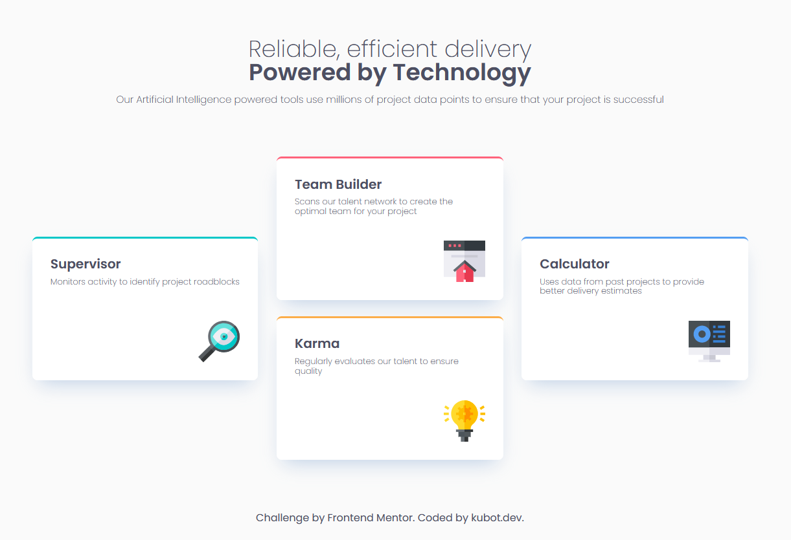

# Frontend Mentor - Four card feature section solution

This is a solution to the [Four card feature section challenge on Frontend Mentor](https://www.frontendmentor.io/challenges/four-card-feature-section-weK1eFYK). Frontend Mentor challenges help you improve your coding skills by building realistic projects.

## Table of contents

- [The challenge](#the-challenge)
- [Screenshot](#screenshot)
- [Links](#links)
  - [Built with](#built-with)
  - [What I learned](#what-i-learned)
  - [Continued development](#continued-development)
- [Author](#author)

### The challenge

Users should be able to:

- View the optimal layout for the site depending on their device's screen size

### Screenshot

### Links

- Solution URL: [https://www.frontendmentor.io/solutions/css-grid-and-flex-used-mobile-first-approach-JplCwsnvu2]
- Live Site URL: [https://four-card-feature-section-master-phi-five.vercel.app/]

### Built with

- CSS custom properties
- Flexbox
- CSS Grid
- Mobile-first workflow

### What I learned

Learned css custom properties basics.

### Continued development

Get better and more comfortable with using grid and flexbox.

## Author

- Frontend Mentor - [@kubot.dev](https://www.frontendmentor.io/profile/kubot-dev)
